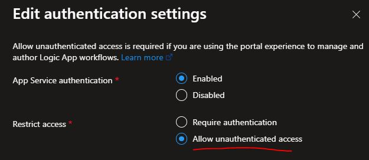
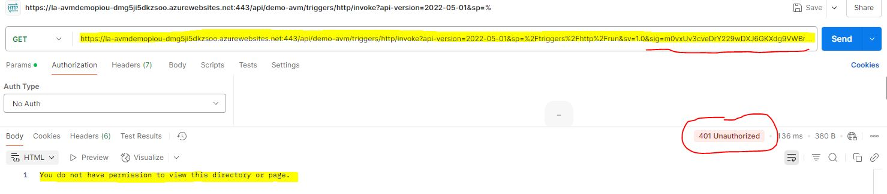

# Exploring Azure Verified Modules (AVM) for Secure Resource Deployment

In this article, I explored the capabilities of **Azure Verified Modules (AVM)** to evaluate how they can streamline the deployment and configuration of Azure resources. AVM are an interesting initiative designed to simplify infrastructure provisioning while enforcing best practices—particularly regarding security.

This sandbox demonstrates the deployment of a secure Azure solution using Azure Verified Modules (AVM) and Bicep templates to provision a Logic App Standard and a Function App. Key features include network isolation with Private Endpoints, authentication and authorization via Managed Identities and EasyAuth, and sensitive data protection using Azure Key Vault. The guide showcases best practices for secure resource deployment, including RBAC enforcement, integration of private networking, and testing scenarios to validate authentication mechanisms.

## Demo Overview and Scenario

Below is a representative diagram of the main components involved in the solution:

In this demo, a **Logic App Standard** workflow exposes an **HTTP trigger** to invoke a **Function App** in three different ways:

1. **Anonymously**
2. Using its **System-Assigned Managed Identity**
3. Using a **User-Assigned Managed Identity**

An external client is able to call the workflow directly. For this to work and for the sake of the demo, **only the Logic App Standard is publicly accessible**, making it easy for the client to initiate the call. All other resources are **isolated from the public internet** through network infrastructure and **Private Endpoints**.

A **Key Vault** and a **User-Assigned Managed Identity** are used to securely store and access sensitive information within the solution.

## Key Concepts Covered

- ✅ **Use of Azure Verified Modules (AVM)** for resource deployment and configuration.
- ✅ **Separation of concerns** between networking artifacts and application components. For this, the demo deploys 2 Resources Group.
- ✅ **Network isolation** using **Private DNS Zones** and **Private Endpoints**, with public access granted only to the Logic App for demonstration purposes.
- ✅ **EasyAuth integration** to protect both the Logic App and the Function App using **Azure Entra ID**:
  - Only the Logic App is authorized to call the Function App.
  - The Logic App itself is later protected so that **only a specific application** can invoke it.
- ✅ **Sensitive data protection** by storing secrets in **Azure Key Vault**, such as access keys for Storage Accounts.

---

## About the Demo

The following points highlight key aspects of the implementation:

- **All components are deployed and configured using Azure Verified Modules (AVM)**. Each module is referenced using the `br/public:avm...` prefix.
  
- The **Logic App Standard is intentionally left publicly accessible**, despite being integrated into the private network to communicate with the Function App. This is done to facilitate external testing for demo purposes.  
  > AVM configuration: `"publicNetworkAccess": "Enabled"` in the Logic App module.

- **Sensitive information is securely managed using AVM + Key Vault integration**. For example, Storage Account connection strings are automatically obfuscated in the Keyvault with the `secretsExportConfiguration` property of the Storage Account module and retrieved via identity-based authentication.   
Also, backend Storage Accounts used by the FunctionApp and the LogicApp are accessed natively with RBAC and no Connection String using these properties in the App Service modules:
  - `storageAccountResourceId: storageAccountId`  
  - `storageAccountUseIdentityAuthentication: true`

- Logic App and Function App require specific roles on their respective backend Storage Accounts (to manage their content, runtime stack, etc...). Access control and RBAC permissions are automatically managed using AVM modules. Required roles are:
  - `Storage Blob Data Owner`
  - `Storage Table Data Contributor`  
  These are granted automatically through dedicated submodule still using AVM, the `rbac-storage.bicep` module, called directly from within each App Service module.

- **EasyAuth Configuration**

  EasyAuth configurations are applied to both the **Function App** and the **Logic App Standard**. This is done using the `authSettingV2Configuration` property. This setup restricts access to these services to only specific, authenticated clients. An additional parameter is injected in the AppSettings to restrict authentication to the current tenant only (`WEBSITE_AUTH_AAD_ALLOWED_TENANTS`).

  - For the **Function App**, incoming calls are limited strictly to those originating from the Logic App, using a **User-Assigned Managed Identity** that has been explicitly linked to the Logic App.  
    *(Note: We could have also used the System-Assigned Identity in a similar way.)*

  - For the **Logic App**, we enforce strict access control using **Azure Entra ID authentication**. This approach ensures that:
    - Calls using a Shared Access Signature (SAS) token passed via the query string (`sig=` parameter) are **blocked**.
    - Only authenticated and authorized clients can invoke the Logic App workflows.

- **Workflow Authentication Test Scenarios**

  The workflow in this demo is specifically designed to validate the EasyAuth configuration by making **three separate calls** to the Function App using different authentication mechanisms:

  1. **Anonymous Access**  
     - *Expected Outcome*: Request should be **denied** due to lack of authentication.  
     - *HTTP Response*: `401 Unauthorized`

  2. **System-Assigned Managed Identity**  
     - *Expected Outcome*: Request should be **denied** because, although authenticated, the identity is **not authorized**.  
     - *HTTP Response*: `403 Forbidden`

  3. **User-Assigned Managed Identity**  
     - *Expected Outcome*: Request should **succeed**, as the identity is both authenticated and authorized by EasyAuth configuration.  
     - *HTTP Response*: `200 OK`

## Running the Sample

💡 **Before running the sample:**
- Give a unique name to the `var solutionName = ''` variable in the Bicep Params file (`main.bicepparam`). 
- Set your Tenant ID and your Subscription ID in the PowerShell `Deploy.ps1` file.

Then, to run the demo, execute the `Deploy.ps1` script, providing your Azure connection details. The script provisions all required components, including the Logic App Standard workflow and the test function for the Function App used for the demo.

### Deployment Sequence

1. Deploys the demo components using the provided Bicep template and Params.
2. Packages and deploys the Logic App workflow for the demo.
3. Temporarily disables network isolation on the Function App to allow deployment of the test function.
   > ⚠️ *This is done for simplification purposes only and is **not recommended** in a real environment.*
4. Builds and deploys the function used in the demo (simple callback function).
5. Re-enables network isolation for the Function App after the deployment.
6. Cleans up temporary resources used during deployment.

## Test the Solution

### From the Azure Portal

We can begin testing the solution by manually running the Logic App workflow directly from the Azure Portal. However, due to the current **EasyAuth configuration**, there is an important restriction to be aware of.

By default in our demo, **EasyAuth is configured to reject all unauthenticated requests** (resulting in a `401 Unauthorized` error). This behavior prevents us from executing the workflow trigger from the portal interface, as the test execution is not performed in an authenticated context (it's mentioned in the portal).

  

If we attempt to run the workflow without making changes, the trigger will fail with an authentication error:

  

To work around this, we can **temporarily allow unauthenticated requests** while testing from the portal. This setting can be modified in the **EasyAuth (Authentication) configuration** for the Logic App:

Once this change is made, you can manually run the Logic App from the portal and observe the different outcomes based on the authentication method used in each call to the Function App.

**Observing the Results**

Once the workflow is triggered, it will sequentially invoke the Function App using the three authentication methods described earlier:

1. **Anonymous Access** → Should return `401 Unauthorized`
2. **System-Assigned Managed Identity** → Should return `403 Forbidden`
3. **User-Assigned Managed Identity** → Should return `200 OK`

Each call's response is Captured and stored in the Logic App run history. You can inspect each HTTP action directly in the portal:

Clicking on each action will show the HTTP status code and response body. This helps confirm that EasyAuth is correctly configured to enforce both authentication and authorization logic:

- The **anonymous request** was rejected as expected:

- The **System-Assigned Identity** was authenticated but not authorized:

- The **User-Assigned Identity** was both authenticated and authorized, resulting in a successful call:

As expected, thanks to the Function App's EasyAuth configuration, only the call using the **User-Assigned Managed Identity** was able to execute successfully.

### From an external client (like Postman) with Authentication restrictions

Now that we have validated the internal Logic App-to-Function App communication, we can test access to the Logic App from an **external client** (Postman in our demo).

By default, Azure Logic Apps (Standard) workflows HTTP trigger provide a public endpoint that can be triggered using a **Shared Access Signature (SAS)** token via the `sig` query parameter. However, in this setup, we have **disabled anonymous access** via EasyAuth to ensure that only **authenticated clients** can trigger the workflow.

This means that any external caller must:

1. Authenticate against **Azure Entra ID** using **OAuth2**.
2. Obtain a valid **access token** for the Logic App application (as defined in EasyAuth settings).
3. Include the token in the `Authorization: Bearer <token>` header when invoking the Logic App trigger endpoint.
4. Requests using only the `sig` token will be rejected with `401 Unauthorized`.
5. If we use both Entra AD authentication and the `sig` token, the request will be rejected as only one authentication scheme is allowed (and the `sig` token cannot be disabled).  

---  
  
> ℹ️ For this part of the demo, we will perform the required configuration steps manually in order to better understand the mechanisms at play. However, all of these steps could be fully automated.

**Trigger the workflow using the default HTTP endpoint**

Grab the URL from the workflow's page properties (note that this URL contains the `sig` token):

Invoke the workflow using Postman with no authentication. As you see, the invocation works because we passed the `sig` token and our EasyAuth configuration accepts unauthenticated requests.

**Reactivating Authentication on the Logic App**

To begin, re-enable authentication on the Logic App.

Because we enabled **Entra ID authentication** on our Logic App, if we try to invoke it using the default URL that includes the SAS token, we receive the expected **401 Unauthorized** error.  
This happens because—even though the SAS token is present—the request is **not authenticated via Entra ID**.

Now, to invoke my workflow, I need to build an authenticated call using a `Bearer Token` and remove the `sig` token because, as previously mentioned, both authentication schemes are not allowed (actually, we only need to keep the "api-version" parameter).

A short and easy way to make an authenticated call is to obtain an Access Token using Azure CLI. Open a session using `az login` with your credentials then use `az account get-access-token --query accessToken -o tsv | clip` to copy the access token in the clipboard. Finally, use the token in Postman to make an authenticated call (this time using your identity). Don't forget to clean-up the querystrings to keep only "api-version".

Now that the call is authenticated, we are able to execute our workflow successfully.  
However, there is still an issue: any authenticated user within our tenant (including ourselves) can invoke the workflow. It would be useful to restrict calls to only specific clients or identities. This level of control can be achieved using the EasyAuth configuration.

In the following steps, we will see how to implement such restrictions.

Let's build an Application Registration for that.

**Creating an App Registration**

We need an **App Registration** to obtain an identity for authentication purposes.  
Create a new App Registration from the Azure portal using the default settings, and generate a client secret.  
Make sure to note down the **Client ID** and **Client Secret** for later use.

**Restricting Logic App Access to This App Only**

Now restrict the Logic App authentication to only accept requests coming from the newly created application. You’ll need the **Client ID** (Application ID) and the **Object ID** of your App Service Principal for this step. You can find these values under the **Enterprise Applications** section in Entra ID for your app.

Then, configure restrictions in the Logic App Authentication configuration. Set respectively the **Application ID** and the **Object ID** to the **Client application requirement** and the **Identity requirement** sections then, in **Tenant requirement** section, restrict to allow requests only from the issuer tenant.

This completes the configuration prerequisites.  
You can now test the with different authentication scenarios.

**Test call to the workflow after restrictions have been applied**

Now that we have applied restrictions so that only our newly created application is allowed to make calls,  
we can try invoking the workflow again using our own identity, as in the previous example.

We can observe that the call is now no longer authorized, returning a `403 Forbidden` error,  
which indicates that although the request is authenticated, **we are not authorized** to make this call.

**Using Postman to Obtain an Access Token for our Application**

Finally, we will use Postman to obtain an `Access Token` for our new application (using the Client Credentials Flow). In this case, the identity used to make the call is **that of the application**, not your own user identity.

Once the token is obtained, copy it and use it to make a new call to the workflow.

This time, the call **succeeds**, because it comes from an application that has been explicitly authorized to make requests.

We can see all our calls in the Logic App workflow history but remember, in order to see and manage them from the Azure Portal, you need to 'temporary disable' authenticated request else the page won't display anything.

## Conclusion

This concludes this exploration of the Azure Verified Modules (AVM) and some of the benefits they can provide. I found them really valuable in helping us strengthen our cloud architectures and deployments.  
They offer real benefits, and I will definitely continue to follow this initiative closely.

Thank you for taking the time to read this article.

Don't forget to clean-up your Azure resources 😋